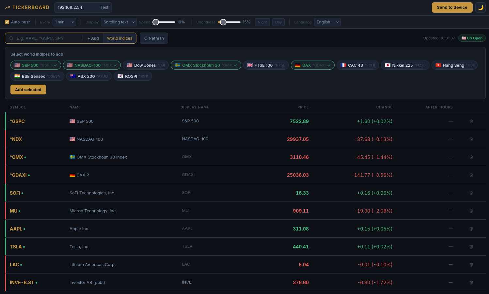

# Tickerboard

Realtidsöversikt för aktier och index i webbläsaren - med automatisk push till din [Ulanzi TC001](https://www.ulanzi.com/products/ulanzi-pixel-smart-clock-2882) pixeldisplay som kör [AWTRIX3](https://blueforcer.github.io/awtrix3/)-firmware.




[English instructions](README.md)

---

## Kom igång

### Steg 1 - Flasha AWTRIX3-firmware på din Ulanzi TC001

TC001 levereras med sin egen firmware. Du behöver ersätta den med AWTRIX3 för att använda Tickerboard.

1. Anslut TC001 till datorn via USB-C
2. Öppna **Google Chrome** eller **Microsoft Edge** (andra webbläsare stöder inte Web Serial)
3. Gå till AWTRIX3 web flasher: **https://blueforcer.github.io/awtrix3/#/flasher**
4. Klicka **Connect**, välj TC001:s serieport och följ stegen på skärmen
5. Efter flashningen startar enheten om och öppnar en Wi-Fi-hotspot med namnet **AWTRIX_XXXXXX**
6. Anslut datorn till den hotspoten, gå till **http://4.3.2.1**, ange dina Wi-Fi-uppgifter och spara
7. Enheten ansluter till ditt nätverk - kolla routern eller displayen för att hitta IP-adressen (t.ex. `192.168.1.54`)

> **Obs:** Flashningen ersätter den ursprungliga firmware. Det går att återställa - du kan alltid flasha tillbaka originalfirmware från Ulanzis webbplats.

#### Om web flashern inte fungerar - använd esptool

Web flashern kräver en kompatibel webbläsare och kan ibland misslyckas. I så fall kan du flasha manuellt med esptool:

1. Installera esptool: `pip install esptool`
2. Ladda ner den senaste AWTRIX3-firmware som `.bin`-fil från [github.com/Blueforcer/awtrix3/releases](https://github.com/Blueforcer/awtrix3/releases)
3. Hitta din serieport - på Windows visas den som `COM3` (eller liknande) i Enhetshanteraren, på Linux som `/dev/ttyUSB0` eller `/dev/ttyACM0`
4. Radera flashminnet:
   ```
   esptool.py --port COM3 erase_flash
   ```
5. Flasha firmware:
   ```
   esptool.py --port COM3 write_flash 0x0 awtrix3.bin
   ```
   Ersätt `COM3` med din faktiska port och `awtrix3.bin` med det nedladdade filnamnet.
6. Enheten startar om och öppnar `AWTRIX_XXXXXX`-hotspoten - fortsätt sedan från steg 5 ovan.

---

### Steg 2 - Ladda ner Tickerboard

Hämta senaste versionen under [Releases](../../releases/latest):

| Plattform | Fil |
|-----------|-----|
| Windows   | `Tickerboard.exe` |
| Linux     | `tickerboard-linux` |
| macOS     | `tickerboard-mac` |

---

### Steg 3 - Kör Tickerboard

**Windows**

Dubbelklicka på `Tickerboard.exe`. En ikon visas i systemfältet och webbläsaren öppnas automatiskt på `http://localhost:8000`.

> Windows Defender kan varna om okänd utgivare. Klicka **Mer information** och sedan **Kör ändå**.

**Linux**
```bash
chmod +x tickerboard-linux
./tickerboard-linux
```
Öppna sedan `http://localhost:8000` i webbläsaren.

**macOS**
```bash
chmod +x tickerboard-mac
./tickerboard-mac
```
Webbläsaren öppnas automatiskt. Om macOS blockerar appen, högerklicka och välj **Öppna**, bekräfta sedan.

---

### Steg 4 - Anslut till displayen

1. Öppna Tickerboard i webbläsaren
2. Ange TC001:s IP-adress i fältet **AWTRIX IP**
3. Kryssa i **Auto-push to device**
4. Klicka **Refresh** - dina tickers visas nu på displayen

---

## Funktioner

### Tickerhantering

- **Lägg till tickers** - skriv en symbol (t.ex. `AAPL`, `^GSPC`, `TSLA`, `INVE-B.ST`) i sökfältet och tryck Enter eller klicka **+ Lägg till**
- **Världsindexpanel** - klicka **Världsindex** för att öppna en panel med 12 stora globala index grupperade per flagga. Klicka ett index för att markera det, klicka sedan **Lägg till valda**. Klicka ett grönt index för att ta bort det direkt från din lista.
- **Ta bort tickers** - klicka på soptunneikonen på valfri rad
- **Anpassat visningsnamn** - klicka på visningsnamnsfältet på en rad och ange ett kortnamn (t.ex. `INVEB` istället för `INVE-B.ST`). Det här namnet visas på AWTRIX-displayen istället för symbolen.

### Data

- Livepriser via Yahoo Finance med förhandels- och efterhandelsdata
- En grön prick bredvid symbolen betyder att marknaden handlas aktivt just nu
- Tabellen visar: symbol, fullständigt namn, visningsnamn, pris, daglig förändring och förhandels-/efterhandelsförändring
- Marknadsstatus (uppe till höger) visar aktuell US-session: Öppen, Förhandel, Efterhandel eller Stängd

### AWTRIX-display

- **Auto-push** - när aktiverat skickas data automatiskt till displayen vid varje uppdatering
- **Skicka till enhet** - manuell push när som helst
- **Rullande text** - alla tickers rullar som ett sammanhängande textband
- **En i taget** - varje ticker visas som ett statiskt helskärmskort som växlar mellan alla tickers
- När någon marknad handlas aktivt (t.ex. OMX30 under europeiska timmar) visas bara de aktiva tickersna på displayen
- Grön färg = positiv förändring, röd = negativ

### Inställningar

Alla inställningar sparas automatiskt och återställs vid nästa start.

| Inställning | Beskrivning |
|-------------|-------------|
| Auto-push | Pusha automatiskt till displayen vid varje uppdatering |
| Var | Uppdateringsintervall (10 sek till 10 min) |
| Display | Rullande text eller en ticker i taget |
| Hastighet | Rullhastighet (gäller bara rullande läge) |
| Ljusstyrka | Displayens ljusstyrka, med Natt (~15%) och Dag (~70%) som förinställningar |
| Språk | Engelska eller svenska |

### Ljust och mörkt läge

Klicka på måne-/solikonen uppe till höger för att växla mellan mörkt och ljust läge. Inställningen sparas i webbläsaren.

---

## Konfiguration

Alla inställningar sparas automatiskt i `config.json` i samma mapp som programmet - inga manuella ändringar behövs. Filen skapas vid första start.

---

## Bygg från källkod

Kräver Python 3.10+.

```bash
pip install -r requirements.txt
```

**Windows:**
```
build.bat
```

**Linux:**
```bash
pip install pyinstaller
pyinstaller --onefile --name tickerboard-linux --add-data "static:static" main_linux.py
```

**macOS:**
```bash
pip install pyinstaller
pyinstaller --onefile --name tickerboard-mac --add-data "static:static" main_mac.py
```

**Kör i dev-läge:**
```bash
uvicorn app:app --reload --port 8000
```
